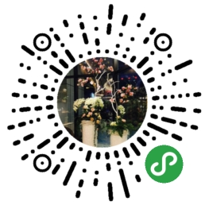
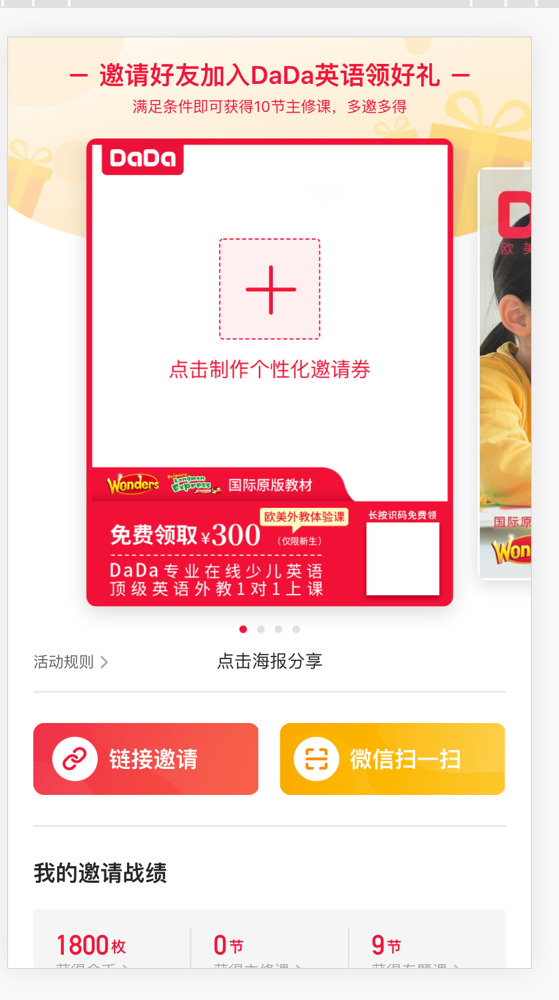
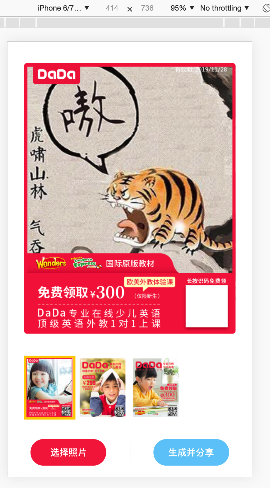
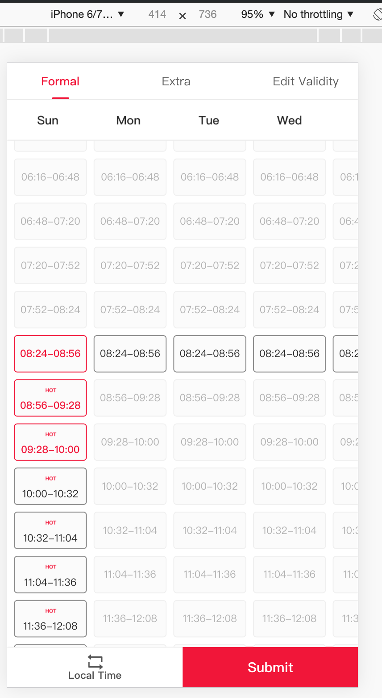
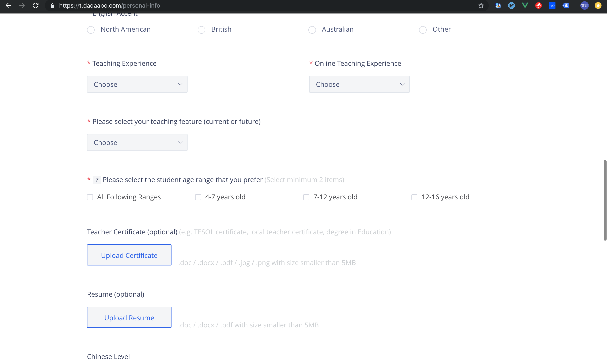
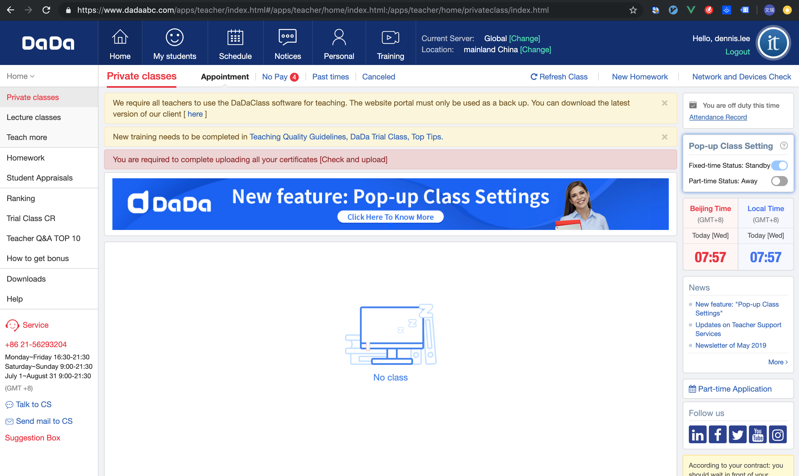
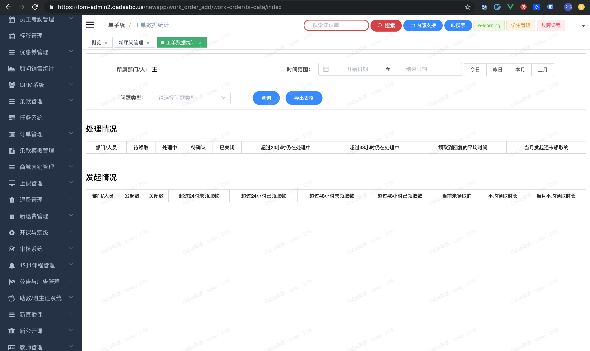

# 
赵文瑞-前端

:::tip
+ 男/30岁
+ 专科/建工
+ 工作年限: 3.5
+ 期望职位: Web前端
+ 期望城市:上海
:::

`性格随和勤奋, 具有较好的团队协作能力, 3年多前端经验, 熟悉模块化、Webpack编译构建工具、熟练掌握 Javascript(ES6), 对 MVVM 模式有一定理解, 并有2年 Vue 实际项目的开发经验, 有独立分析问题解决问题的能力, 良好代码规范, 可按时按质完成日常需求开发并保证用户体验, 熟练代码的调试、bug修复浏览器兼容性问题的解决, 对网站优化有一定的理解`

### 个人能力
+ 精通: Javascript/VueJS(生态)/Html5/Css3/Axios/Bootstrap/Jquery/RequireJS
+ 熟练: Webpack/VScode/Chrome调试/ESlint/Git/Prettier/Sass
+ 了解: NodeJS/微信小程序

### 联系方式
+ 手机号: 18655878206
+ Email: zhaowenrui5474@gmail.com

### 工作经历
**`上海卓赞教育科技有限公司（2016-06 至 2019-05）`**
1. 负责老师端: 老师中心PC/老师App/外教招募 项目的搭建与维护
2. 采用Vue + ES6 + Webpack + Git的构建方式替代旧版 Svn + RequireJS+ Jq的构建方式
3. 负责老师端Vue基础组件编写、公用方法封装，老旧项目代码优化，制定项目迭代计划
4. 参与需求评审、技术评审，对用户体验、项目质量负责
5. 配合后台开发、测试等部门定位bug、提供备用技术方案

+ **外教招募(2018)**
1. 业务上需要欧美外教加入，以往是通过收邮件的方式获取老师资料后审核，该方式成本高，能效低，不能很好的获取优质的外教资源，
所以创建此项目
2. 流程：老师注册 --> 简历填写 --> 据规则自动筛选合格的老师 --> 老师基本培训(引导视频、试卷) --> 老师在线面试 --> Offer --> 老师中心
4. 项目难点: 简历必选加选填共30多个字段，要求用户填写时实时验证，保证提交通过率，并且刷新页面后保留用户所填信息，保证用户的体验，必填时区值与本地时区不符时强提示，项目覆盖移动端；
5. 产出：招募流程自动化，减少90%的人力投入；

+ **老师中心/老师App(2017)**
1. 服务于外教（1万人+），有老师合同、签到打卡、车位管理、上课列表、老师培训、个人中心等等多个模块
2. 项目初始是沿用之前的 RequireJS + Jq 搭建，随着时间迁移，业务代码堆积不利于维护、不能使用新语法、开发效率低等等原因，决定使用当下流行的Vue + ES6 + Webpack + Git + 组件库的构建方式对项目进行重构迭代
3. 移动端采用Vw单位 + Sass函数适配750设计稿
4. 迭代方案：充分了解旧版业务逻辑，新仓库实现公用功能后，老路由重定向SPA新路由
5. 项目难点：老代码难啃，重构前期没有产出，Webpack配置繁琐踩坑等
6. 产出：可以模块化来更好的拆解需求，书写新的语法特性，提升开发效率(30%)、体验、用户体验，也提升了个人分析问题解决问题的能力，更新自己的技术栈

+ **学生App(2017)**
1. 参与部分开发：邀请有礼海报分享
2. 需求：用户选择本地图片（可调整位置、缩放）与海报模板进行拼接，生成合成图，分享至微信和app
3. 开发依赖：Vue + Hammer
4. 开发思路：用户选择本地图片使用URL.createObjectURL()方法生成图片预览和模板图片进行拼接 > 使用HammerJS
手势库识别用户移动和缩放的手势并用于所选图片的移动、缩放 > 点击分享海报，将用户所选图片上传至文件服务器 > 将用户图片和模板图片使用图片管道处理的方式拼接在一起，并展示 > 点击分享微信调用微信的分享api，点击app分享调用app端提供的注入方法
5. 项目难点：最初的开发方案因为canvas生成合成图在安卓端卡顿loading时间长、canvas.toBlob()方法生成的blob二进制文件在ios端受安全策略影响无法上传等原因改为使用文件服务的图片管道处理进行拼接图片并分享
6. 产出：功能上线后日分享千次，引流效果明显

+ **小程序(2018)**
1. 小程序主要由学生组前端负责开发，因为公司技术栈是Vue,所以采用了MPVue作为小程序的开发框架
2. 为了了解小程序，我在业余的时间做了比较简单的静态的小程序  

+ **后台管理中心(2016)**
1. 项目前期是Jq + Bootstrap方式（之后由其他前端同学使用ifram + Vue + Element 方式重构）
2. 做了权限管理、工单系统、公开课等
3. 服务于公司内部工作人员对相关数据进行增删改查

**`上海中优集团 （2015-10 至 2016-05）`**
1. 部门购物平台pc端与微信公众号中优医药的样式调整、网页改版
2. 天猫、1药网店铺的详情网页的代码编写并做一定的seo优化
3. 熟练处理常见的兼容问题、根据功能需要书写JS脚本
4. 积极配合设计和后台工作

+ **中优商城(2015)**
1. 此项目属于网销部，是网销部线上交易平台之一，主营各类消毒产品
了解、熟悉项目的整体框架
2. 利用Html5+Css3写出移动端静态弹性页面
3. 使用Jq添加页面特效和交互效果
4. 测试各终端页面

部分作品  

